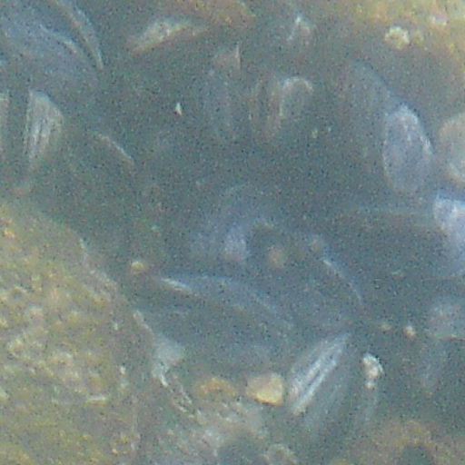
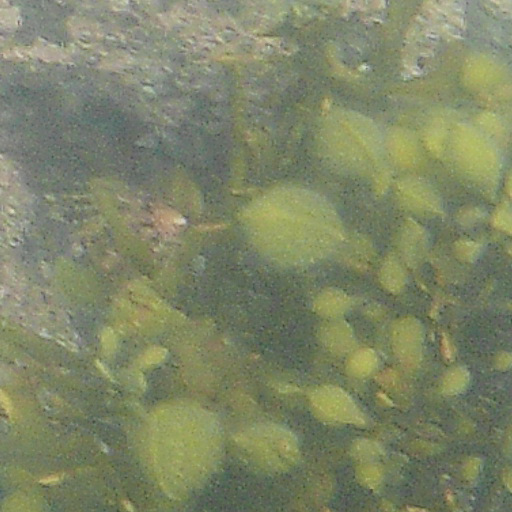
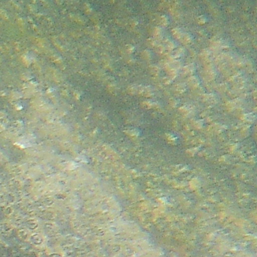
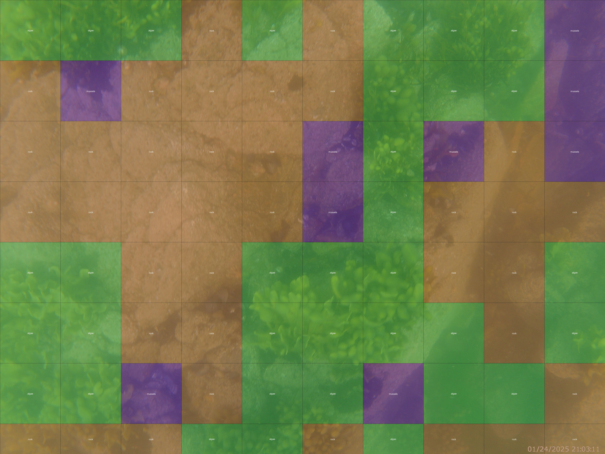

# Ocean Floor Classifier

This repository provides a complete pipeline for slicing ocean floor images into tiles, training a CNN to classify each tile by substrate type, and generating inference overlays on the original images.

---

## Repository Structure

```plaintext
.
├── data
│   ├── raw_images/           # Original JPG images
│   ├── sliced_images/        # Output tiles + labels.csv (generated)
│   └── examples/             # Example images for README
│       ├── raw_example.JPG
│       ├── slice_example_1.png
│       ├── slice_example_2.png
│       ├── slice_example_3.png
│       └── inference_example.JPG
│
├── scripts
│   ├── ImageSlicer.py        # Slice raw images into tiles + stub labels.csv
│   ├── OceanFloorClassifier.py # Train CNN on the tiled data
│   └── InferenceGrid.py      # Run inference on raw images w/ grid overlay
│
├── models/                   # Saved runs
│   └── run_<YYYYMMDD_HHMMSS>/
│       ├── params.json       # Training parameters and class list
│       ├── training_log.csv  # CSV log of loss/accuracy per epoch
│       ├── model.h5          # Saved Keras model
│       └── inference_results/ # Overlaid inference output images
│
├── requirements.txt         # Python dependencies
└── README.md                 # This documentation
```

---

## Setup & Dependencies

1. **Clone the repository**:

   ```bash
   git clone https://github.com/yourusername/OceanFloorClassifier.git
   cd OceanFloorClassifier
   ```

2. **Create & activate a conda environment**:

   ```bash
   conda create -n ocean_env python=3.9
   conda activate ocean_env
   ```

3. **Install requirements**:

   ```bash
   pip install -r requirements.txt
   ```

4. **Verify GPU availability** (TensorFlow):

   ```python
   import tensorflow as tf
   print(tf.config.list_physical_devices('GPU'))
   ```

---

## Usage

### 1. Slice Images

Generate tiles from raw JPGs and stub a `labels.csv`:

```bash
python scripts/ImageSlicer.py \
  --input-dir data/raw_images \
  --output-dir data/sliced_images \
  --tile-size 512 \
  --csv-name labels.csv
```

After slicing, you'll have:

- `data/sliced_images/*.png`
- `data/sliced_images/labels.csv` (tile\_name,label)

### 2. Train Classifier

Train a CNN on the sliced data:

```bash
python scripts/OceanFloorClassifier.py \
  --image-dir data/sliced_images \
  --csv-path data/sliced_images/labels.csv \
  --epochs 100 \
  --batch-size 32 \
  --validation-split 0.2
```

- Reads your `labels.csv`
- Splits into train/validation
- Logs training to `models/run_<timestamp>/training_log.csv`
- Saves artifacts in `models/run_<timestamp>/`

### 3. Run Inference

Overlay predicted labels on the original raw images:

```bash
python scripts/InferenceGrid.py \
  --model-dir models/run_<timestamp> \
  --raw-dir data/raw_images \
  --tile-size 512 \
  --resize 128 \
  --output-name inference_results
```

Results are saved under:

```
models/run_<timestamp>/inference_results/
```

---

## Examples

**Raw Input**


**Sliced Tiles**

- Mussel slice:  
  

- Algae slice:  
  

- Rock slice:  
  

**Inference Overlay**



---

## License

MIT © William Arranz

---

*Feel free to contribute, open issues, and send pull requests!*


