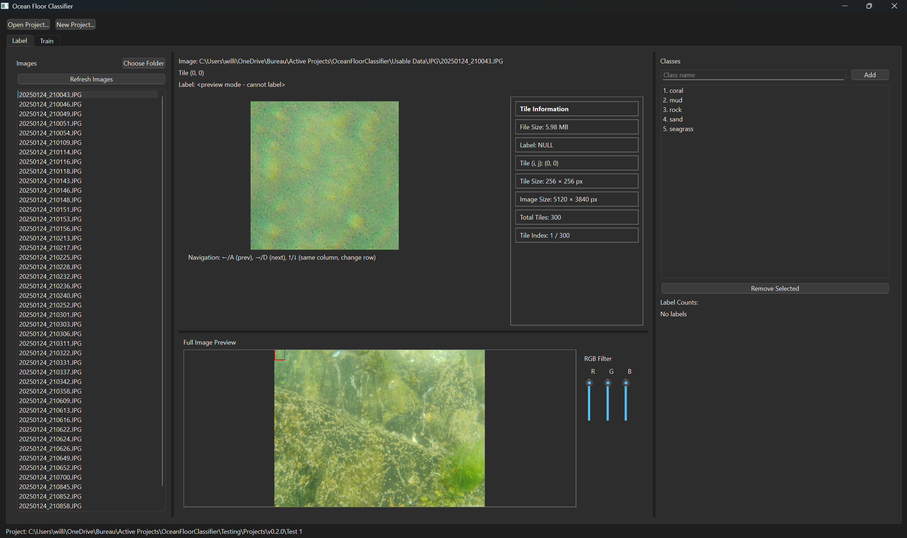
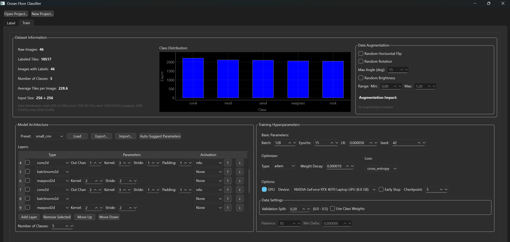
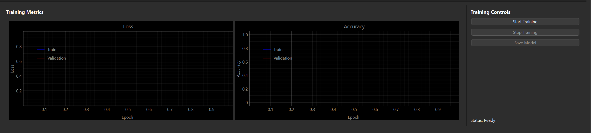
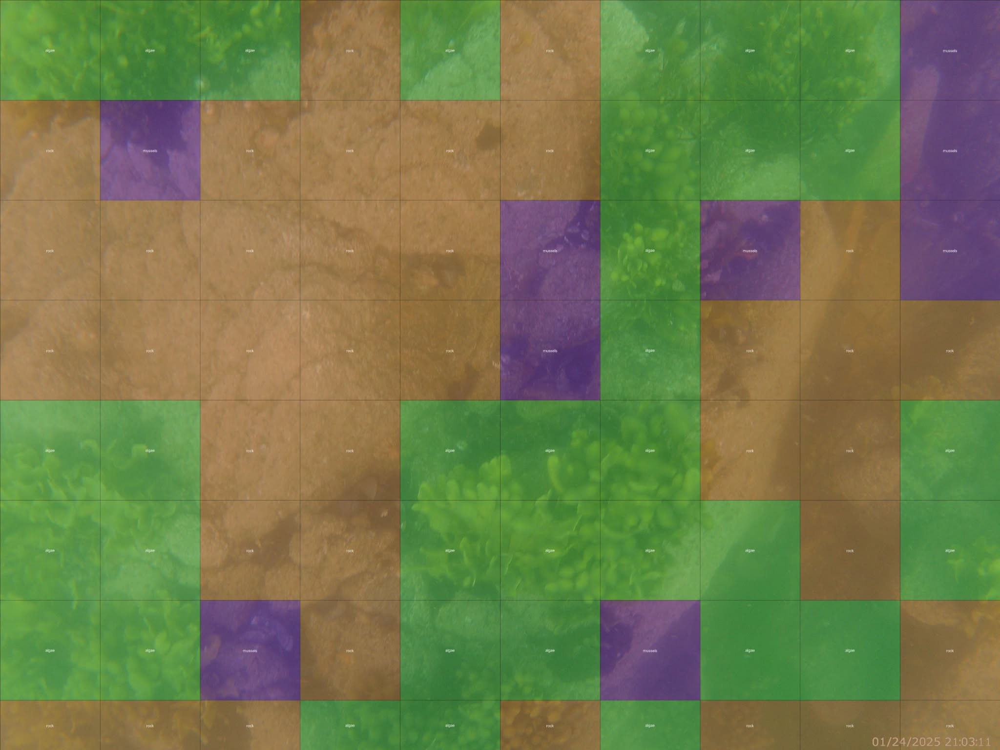

# Ocean Floor Classifier

A machine learning application for classifying ocean floor data.

> **Note:** The GUI is currently in active development. For the fully functional legacy code from 2025, please check out [v0.1.0](https://github.com/CrudeText/ocean-floor-classifier/releases/tag/v0.1.0).

## Features

- Graphical User Interface (GUI)
- Command Line Interface (CLI)
- Core classification functionality
- Training modules
- Inference capabilities

## Installation

### Basic Installation

```bash
pip install -e .
```

### GPU Support (CUDA)

For GPU acceleration during training, a GPU-enabled virtual environment has been set up using Python 3.12.

#### Quick Start (GPU Environment)

A virtual environment with CUDA-enabled PyTorch is already configured in `venv_gpu/`.

**Windows PowerShell:**
```powershell
.\activate_gpu_env.ps1
```

**Windows Command Prompt:**
```cmd
activate_gpu_env.bat
```

**Manual activation:**
```bash
venv_gpu\Scripts\activate
```

Then run the application:
```bash
python -m ofc.gui.app
```

#### Setting Up GPU Support (If Needed)

If you need to recreate the GPU environment:

1. **Python 3.12 is required** (CUDA builds not available for Python 3.14):
   ```bash
   py -3.12 -m venv venv_gpu
   ```

2. Activate the environment:
   ```bash
   venv_gpu\Scripts\activate
   ```

3. Install the project:
   ```bash
   pip install -e .
   ```

4. Install CUDA-enabled PyTorch:
   ```bash
   pip uninstall torch torchvision -y
   pip install torch torchvision --index-url https://download.pytorch.org/whl/cu121
   ```

5. Verify GPU detection:
   ```bash
   python -c "import torch; print('CUDA available:', torch.cuda.is_available()); print('GPU:', torch.cuda.get_device_name(0) if torch.cuda.is_available() else 'CPU only')"
   ```

#### For Python 3.14:

Currently, only CPU-only builds are available. GPU support will be available in future PyTorch releases. The application will work with CPU, but training will be slower.

## Usage

### GUI Mode

#### Installation

First, install the package and dependencies:

```bash
pip install -e .
```

This will install PySide6, Pillow, numpy, and other required dependencies.

#### Running the GUI

```bash
python -m ofc.gui.app
```

#### Creating a Project

1. Click "New Project..." button
2. Select an empty folder (or a folder you want to use for the project)
3. Enter a project name when prompted
4. The project structure will be created automatically

#### Adding Images

1. Copy your raw images (JPG, PNG, TIF, TIFF) into your project's raw images folder (configurable in project settings)
2. Click "Refresh Images" button in the Label tab to update the images list

#### Labeling Tiles



1. Select an image from the left panel
2. The image will be automatically tiled according to the grid configuration
3. Use keyboard shortcuts to label tiles:
   - **1-9**: Assign class at that index (1 = first class, 2 = second class, etc.)
   - **0**: Unlabel (set to empty)
   - **→ / D**: Next tile
   - **← / A**: Previous tile
   - **↑ / ↓**: Jump ±10 tiles
4. Labels are saved immediately to `data/labels.csv`

#### Managing Classes

- Add classes using the text input and "Add" button in the right panel
- Remove classes by selecting them and clicking "Remove Selected"
- Classes are saved to `configs/classes.json`

#### Training



Configure training parameters in the Training tab, including model architecture, hyperparameters, and training options.



Monitor training progress in real-time with live plots showing loss, accuracy, and other metrics.

#### Project Structure

When you create a project, the following structure is created:

```
<project_root>/
  project.json          # Project metadata
  data/
    labels.csv          # Tile labels (auto-generated)
  configs/
    grid.json           # Grid/tiling configuration
    classes.json         # Class names list
  runs/
    train/              # Training outputs
    infer/              # Inference outputs
  exports/
    tiles/              # Exported tiles
```

Note: Raw images are stored in an external folder path (configurable in project settings).

### CLI Mode
```bash
python -m ofc.cli.main
```

## Project Structure

- `src/ofc/core/` - Core application logic
- `src/ofc/gui/` - Graphical user interface
- `src/ofc/cli/` - Command line interface
- `tests/` - Unit and integration tests

#### Inference Example

